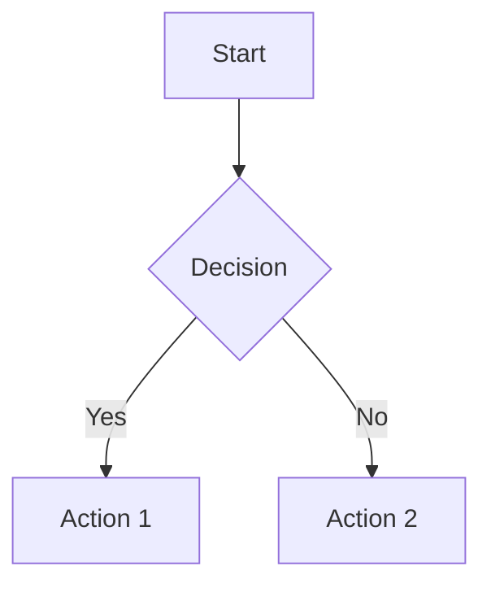
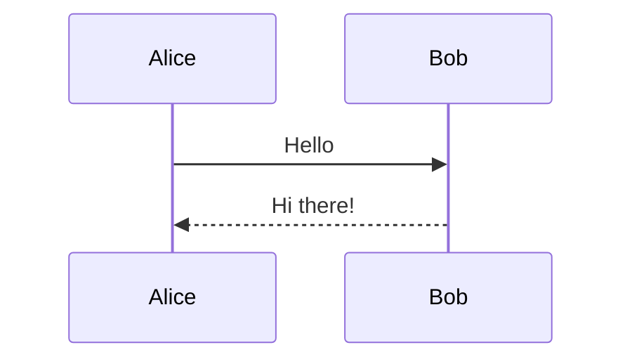

# Stateless Validator Documentation

Welcome to the stateless validator documentation! This directory contains comprehensive visual documentation of the system architecture, data flows, and database operations.

## 📚 Documentation Files

### 1. [Architecture Flowcharts](./architecture-flowchart.md)
**10 detailed flowcharts** showing:
- System overview and component interactions
- Database schema (9 ReDB tables)
- Remote chain tracker flow
- Validation worker process
- Main synchronization loop
- Detailed block validation steps
- History pruner operation
- Chain reorganization handling
- Block state transitions
- Contract bytecode caching

**Best for**: Understanding individual component logic and decision flows

---

### 2. [Architecture Sequence Diagrams](./architecture-sequence.md)
**9 sequence diagrams** showing:
- System startup and initialization
- Block fetching and task creation
- Block validation with database interactions
- Canonical chain growth
- Chain reorganization recovery
- History pruning process
- Validation reporting (optional)
- Complete block lifecycle with state changes
- Database table interaction summary

**Best for**: Understanding component interactions and timing of database operations

---

### 3. [Viewing Diagrams Guide](./viewing-diagrams.md)
**Complete setup guide** including:
- VS Code plugin recommendations
- Installation instructions
- Usage instructions
- Export options
- Troubleshooting tips

**Best for**: Getting started with viewing the diagrams

---

## 🚀 Quick Start

### For New Team Members:

1. **Install the VS Code extension**:
   - Open VS Code Extensions (`Cmd+Shift+X` / `Ctrl+Shift+X`)
   - Search for "Markdown Preview Mermaid Support"
   - Install the extension by Matt Bierner

2. **Open the diagrams**:
   ```bash
   code docs/architecture-flowchart.md
   code docs/architecture-sequence.md
   ```

3. **View the rendered diagrams**:
   - Press `Cmd+Shift+V` (macOS) or `Ctrl+Shift+V` (Windows/Linux)
   - Scroll through the beautifully rendered diagrams

4. **Study the flows**:
   - Start with the **System Overview** flowchart
   - Then read the **System Startup** sequence diagram
   - Follow the **Complete Block Lifecycle** diagram to understand the full data flow
   - Dive into specific components as needed

---

## 🗺️ Learning Path

### For Understanding the System Architecture:

**Beginner** (First Day):
1. Read: `architecture-flowchart.md` → Section 1 (System Overview)
2. Read: `architecture-flowchart.md` → Section 2 (Database Schema)
3. Read: `architecture-sequence.md` → Section 1 (System Startup)

**Intermediate** (First Week):
4. Read: `architecture-flowchart.md` → Sections 3-5 (Tracker, Worker, Main Loop)
5. Read: `architecture-sequence.md` → Sections 2-4 (Block Fetching, Validation, Chain Growth)
6. Read: `architecture-sequence.md` → Section 8 (Complete Block Lifecycle)

**Advanced** (First Month):
7. Read: `architecture-flowchart.md` → Sections 6-10 (Detailed validation, pruning, reorg, caching)
8. Read: `architecture-sequence.md` → Sections 5-7 (Reorg, Pruning, Reporting)
9. Review: `architecture-sequence.md` → Section 9 (Database Table Interactions)

---

## 📊 What Each Diagram Shows

### Database Changes Tracking

All diagrams clearly show **database state changes**:

| Diagram Type | Database Info |
|--------------|---------------|
| **Flowcharts** | Show decision points and which tables are modified at each step |
| **Sequence Diagrams** | Show the exact sequence of reads/writes to database tables |
| **State Diagrams** | Show how block state progresses through different tables |

**Key Tables** (9 total in ReDB):
- `CANONICAL_CHAIN` - Validated blocks forming the local chain
- `REMOTE_CHAIN` - Unvalidated blocks from network
- `TASK_LIST` - Pending validation tasks
- `ONGOING_TASKS` - Tasks being processed
- `BLOCK_DATA` - Raw block data
- `WITNESSES` - SALT witnesses for stateless validation
- `MPT_WITNESSES` - MPT witnesses for withdrawals
- `VALIDATION_RESULTS` - Validation outcomes
- `BLOCK_RECORDS` - Complete history for pruning
- `CONTRACTS` - Bytecode cache
- `GENESIS_CONFIG` - Chain configuration

---

## 🎨 Color Coding

All diagrams use consistent colors:
- 🟦 **Blue**: Database operations, canonical chain
- 🟨 **Yellow**: Task management, pending states
- 🟩 **Green**: Success states, completions
- 🟥 **Red**: Errors, failures, deletions
- 🟪 **Purple**: Data storage, witnesses
- 🟧 **Orange**: RPC calls, external interactions

---

## 🔍 Finding Specific Information

### Want to understand...

**How blocks are fetched?**
→ `architecture-flowchart.md` Section 3 + `architecture-sequence.md` Section 2

**How validation works?**
→ `architecture-flowchart.md` Sections 4 & 6 + `architecture-sequence.md` Section 3

**What happens during a reorg?**
→ `architecture-flowchart.md` Section 8 + `architecture-sequence.md` Section 5

**How data is pruned?**
→ `architecture-flowchart.md` Section 7 + `architecture-sequence.md` Section 6

**Complete block lifecycle?**
→ `architecture-sequence.md` Section 8 (most comprehensive)

**Database schema?**
→ `architecture-flowchart.md` Section 2

**All database operations?**
→ `architecture-sequence.md` Section 9

---

## 🛠️ Maintaining These Diagrams

### When to Update:

Update these diagrams when:
- Adding new database tables
- Changing validation logic
- Modifying component interactions
- Adding new background processes
- Changing state transitions

### How to Update:

1. Diagrams are written in **Mermaid** syntax (plain text)
2. Edit the markdown files directly
3. Preview changes with `Cmd+Shift+V` / `Ctrl+Shift+V`
4. Mermaid documentation: https://mermaid.js.org/

### Mermaid Syntax Quick Reference:





---

## 📖 Additional Resources

### Codebase Locations:
- Main entry point: `bin/stateless-validator/src/main.rs`
- Database operations: `bin/stateless-validator/src/db.rs`
- RPC client: `bin/stateless-validator/src/rpc.rs`
- Block validation: `validator-core/src/executor.rs`
- Witness handling: `validator-core/src/database.rs`
- Chain spec: `validator-core/src/chain_spec.rs`

### External Documentation:
- SALT (stateless validation): [SALT Paper](https://eprint.iacr.org/2024/1740)
- ReDB (database): https://docs.rs/redb/
- REVM (EVM): https://github.com/bluealloy/revm
- Mermaid (diagrams): https://mermaid.js.org/

---

## 💡 Tips for New Developers

1. **Start with the big picture**: Read the System Overview flowchart first
2. **Follow the data**: Track how a block moves through the system using the lifecycle diagram
3. **Understand the database**: The database schema diagram is crucial for understanding data persistence
4. **Learn by tracing**: Pick a single block and trace it through all the diagrams
5. **Compare diagrams**: Cross-reference flowcharts with sequence diagrams for deeper understanding
6. **Use the code**: Reference the diagrams while reading the actual code
7. **Update as you learn**: If you find the diagrams unclear, improve them!

---

## 🤝 Contributing

Found an error or want to improve the diagrams?
1. Edit the markdown files
2. Verify your changes render correctly
3. Submit a pull request with clear description
4. Include screenshots if helpful

---

## ❓ Questions?

If you have questions about:
- **The diagrams themselves**: Check `viewing-diagrams.md` for setup help
- **The architecture**: Review the flowcharts and sequence diagrams
- **Specific components**: Use the "Finding Specific Information" section above
- **The codebase**: Cross-reference diagrams with the actual code

---

## 📝 Document Versions

- **Created**: 2025-11-10
- **Last Updated**: 2025-11-10
- **Diagrams**: Mermaid syntax (compatible with GitHub, VS Code, GitLab)
- **Status**: ✅ Complete and up-to-date with current codebase

---

Happy learning! 🚀
