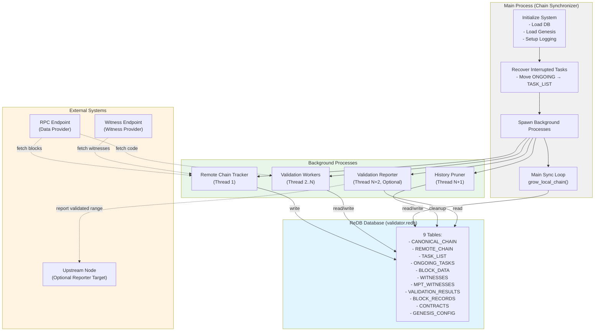
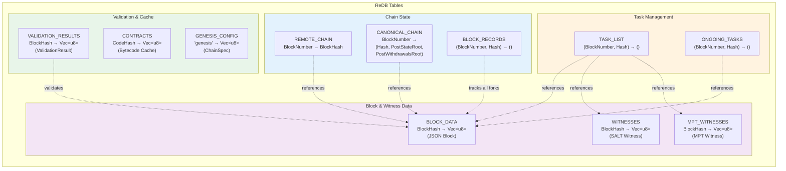
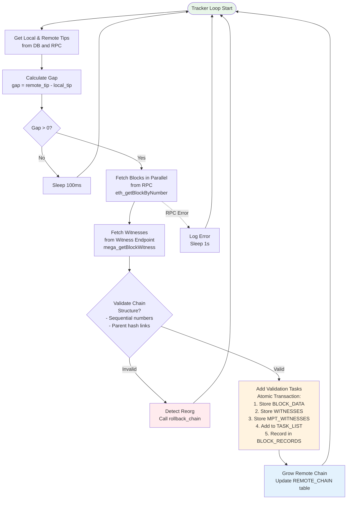
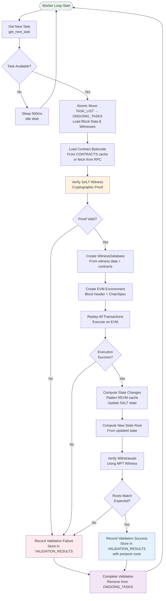
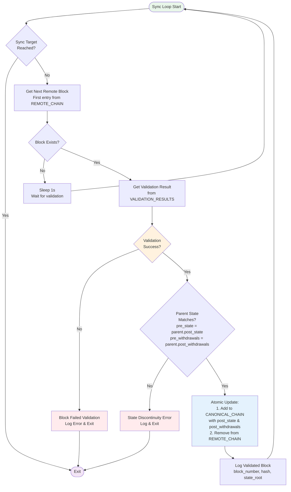
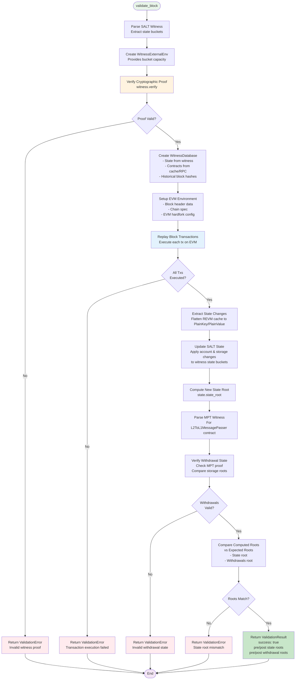
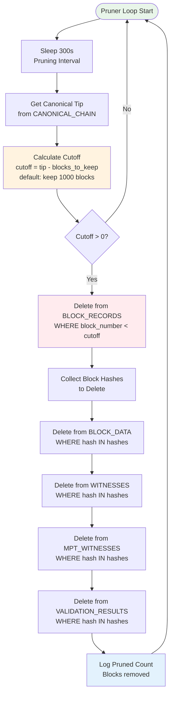
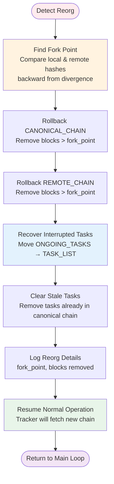
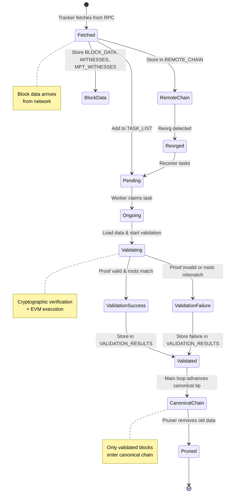
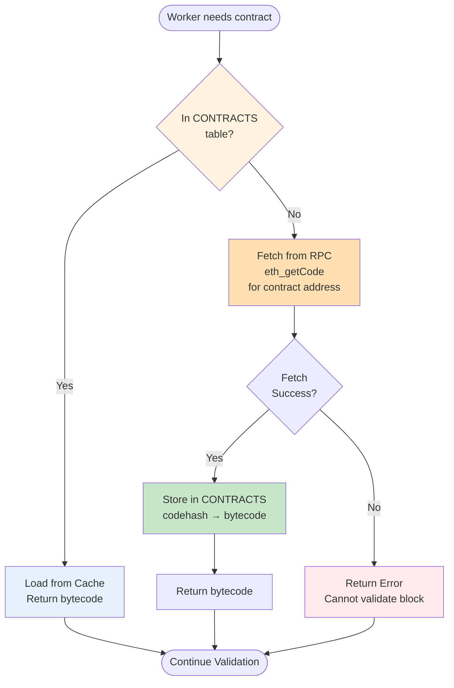

# Stateless Validator Architecture Flowcharts

## 1. System Overview and Component Interaction

## 2. Database Schema and Relationships

## 3. Remote Chain Tracker Flow

## 4. Validation Worker Flow

## 5. Main Sync Loop (grow_local_chain)

## 6. Block Validation Detailed Flow

## 7. History Pruner Flow

## 8. Reorg Handling Flow

## 9. Data State Transitions

## 10. Contract Bytecode Caching

---

## Key Insights for New Developer

### Database Design Principles
1. **Separation of Concerns**: Different tables for chain state, tasks, data, and results
2. **Atomic Operations**: All table updates use transactions for consistency
3. **Efficient Lookups**: Tables keyed by block number or hash for O(1) access
4. **Fork Handling**: BLOCK_RECORDS tracks all forks for efficient pruning

### Data Flow Guarantees
1. **Unvalidated → Validated**: Clear progression through TASK_LIST → ONGOING_TASKS → VALIDATION_RESULTS → CANONICAL_CHAIN
2. **State Continuity**: Each block's pre-state must match parent's post-state
3. **Parallel Safety**: Workers can validate different blocks simultaneously
4. **Reorg Recovery**: System can rollback and recover from chain reorganizations

### Performance Characteristics
1. **Parallel Validation**: Linear throughput scaling with CPU cores
2. **Block Lookahead**: Tracker maintains buffer to keep workers busy
3. **Storage Management**: Automatic pruning prevents unbounded growth
4. **On-demand Caching**: Contract bytecode fetched only when needed
