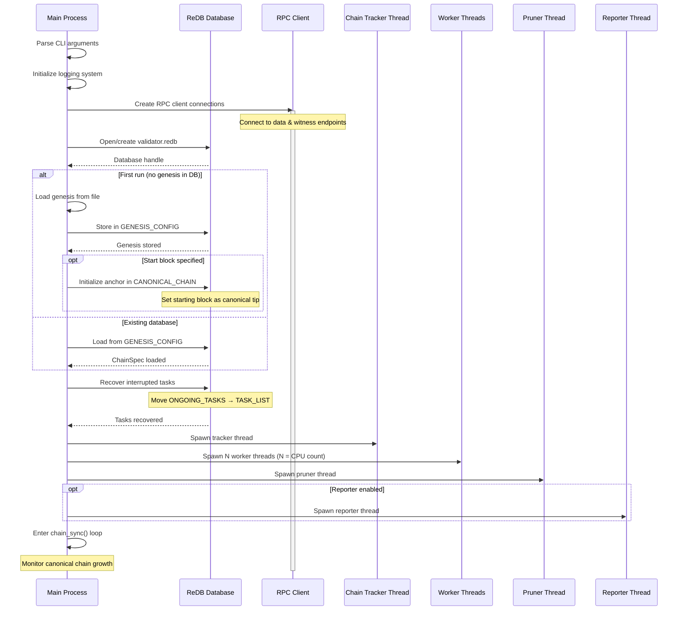
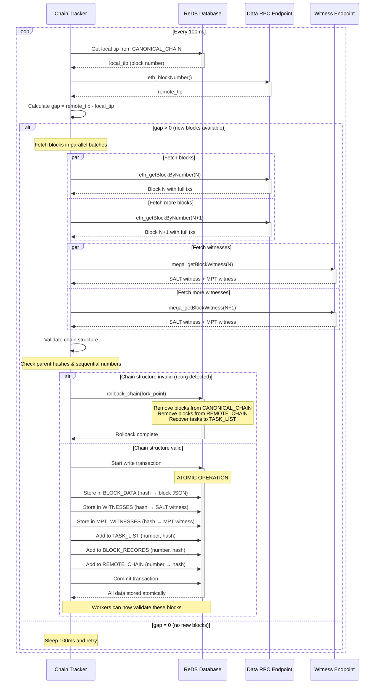
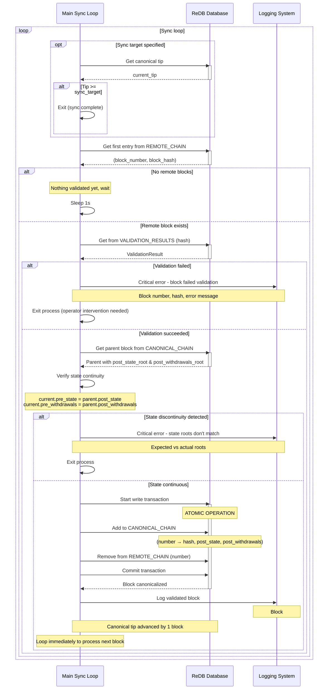
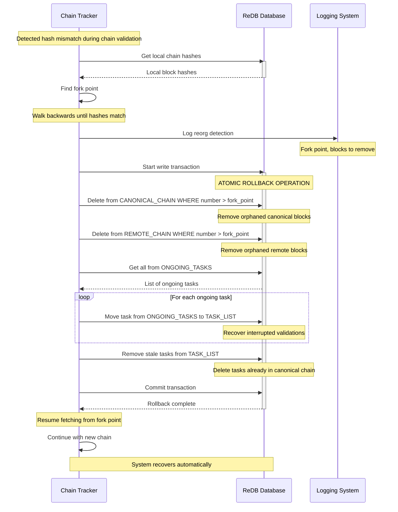
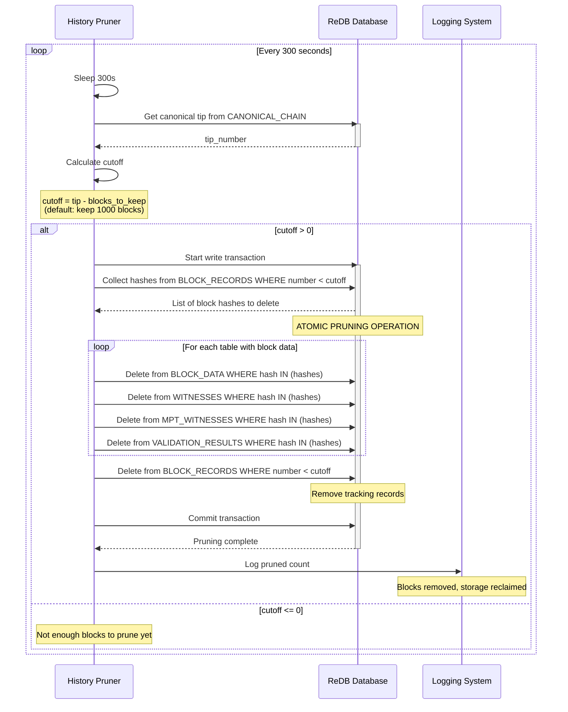
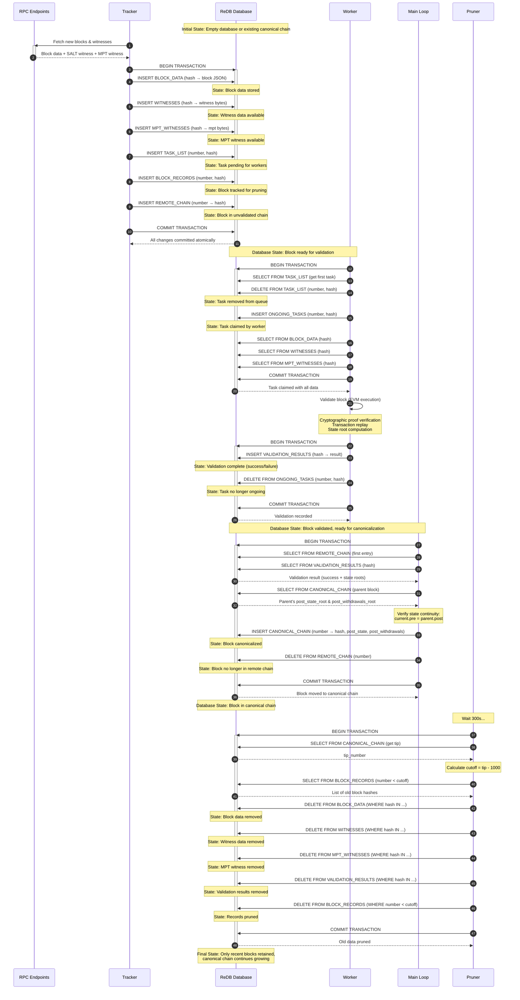
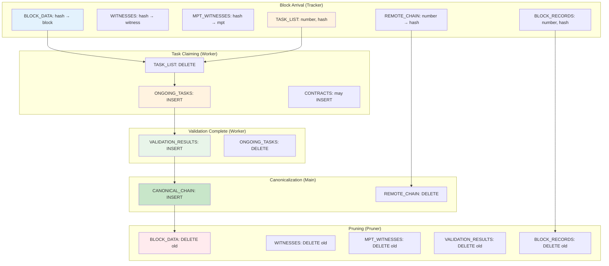

# Stateless Validator Sequence Diagrams

## 1. System Startup and Initialization



## 2. Block Fetching and Task Creation (Tracker)



## 3. Block Validation (Worker)

```mermaid
sequenceDiagram
    participant Worker as Validation Worker
    participant DB as ReDB Database
    participant RPC as RPC Client
    participant WitnessDB as WitnessDatabase
    participant EVM as EVM Engine

    loop Validation loop
        Worker->>DB: get_next_task()
        activate DB

        alt Tasks available
            Note over DB: Find first task >= current canonical tip
            DB->>DB: Move (number, hash) from TASK_LIST to ONGOING_TASKS
            DB->>DB: Load from BLOCK_DATA (hash → block)
            DB->>DB: Load from WITNESSES (hash → witness)
            DB->>DB: Load from MPT_WITNESSES (hash → mpt_witness)
            DB-->>Worker: Task with all data
            deactivate DB

            Worker->>Worker: Parse SALT witness
            Worker->>Worker: Create WitnessExternalEnv

            Worker->>Worker: Verify cryptographic proof
            activate Worker

            alt Proof invalid
                Worker->>DB: Store ValidationResult (success=false, error)
                activate DB
                DB-->>Worker: Result stored
                deactivate DB
                Worker->>DB: Remove from ONGOING_TASKS
                activate DB
                DB-->>Worker: Task completed
                deactivate DB
                deactivate Worker
            else Proof valid
                deactivate Worker

                Worker->>WitnessDB: Create WitnessDatabase
                activate WitnessDB
                Note over WitnessDB: Initialize with witness state data

                loop For each transaction in block
                    Worker->>WitnessDB: Get contract code

                    alt Code in witness
                        WitnessDB-->>Worker: Return from witness
                    else Code not in witness
                        WitnessDB->>DB: Check CONTRACTS table
                        activate DB

                        alt Code cached
                            DB-->>WitnessDB: Return cached bytecode
                            deactivate DB
                        else Code not cached
                            deactivate DB
                            WitnessDB->>RPC: eth_getCode(address)
                            activate RPC
                            RPC-->>WitnessDB: Contract bytecode
                            deactivate RPC

                            WitnessDB->>DB: Store in CONTRACTS (codehash → bytecode)
                            activate DB
                            DB-->>WitnessDB: Cached for future use
                            deactivate DB
                        end

                        WitnessDB-->>Worker: Return bytecode
                    end
                end

                Worker->>EVM: Create EVM environment
                activate EVM
                Note over EVM: Configure with block header & ChainSpec

                Worker->>EVM: replay_block(transactions)
                Note over EVM: Execute all transactions

                alt Transaction execution failed
                    EVM-->>Worker: Execution error
                    deactivate EVM
                    deactivate WitnessDB

                    Worker->>DB: Store ValidationResult (success=false, error)
                    activate DB
                    DB-->>Worker: Result stored
                    deactivate DB
                    Worker->>DB: Remove from ONGOING_TASKS
                    activate DB
                    DB-->>Worker: Task completed
                    deactivate DB
                else Execution successful
                    EVM-->>Worker: State changes (REVM cache)
                    deactivate EVM

                    Worker->>Worker: Flatten cache to PlainKey/PlainValue
                    Worker->>Worker: Update SALT state buckets
                    Worker->>Worker: Compute new state root

                    Worker->>Worker: Parse MPT witness
                    Worker->>Worker: Verify withdrawal state transitions

                    alt Roots match expected values
                        Worker->>DB: Store ValidationResult
                        activate DB
                        Note over DB: success=true<br/>pre_state_root<br/>post_state_root<br/>pre_withdrawals_root<br/>post_withdrawals_root<br/>timestamp
                        DB-->>Worker: Result stored
                        deactivate DB

                        Worker->>DB: Remove from ONGOING_TASKS
                        activate DB
                        DB-->>Worker: Task completed
                        deactivate DB
                        deactivate WitnessDB

                        Note over Worker,DB: Block successfully validated!
                    else Roots mismatch
                        deactivate WitnessDB
                        Worker->>DB: Store ValidationResult (success=false, error)
                        activate DB
                        DB-->>Worker: Result stored
                        deactivate DB
                        Worker->>DB: Remove from ONGOING_TASKS
                        activate DB
                        DB-->>Worker: Task completed
                        deactivate DB
                    end
                end
            end
        else No tasks available
            deactivate DB
            Note over Worker: Sleep 500ms and retry
        end
    end
```

## 4. Canonical Chain Growth (Main Sync Loop)



## 5. Chain Reorganization



## 6. History Pruning



## 7. Validation Reporting (Optional)

```mermaid
sequenceDiagram
    participant Reporter as Validation Reporter
    participant DB as ReDB Database
    participant Upstream as Upstream Node
    participant Log as Logging System

    loop Every 1 second
        Reporter->>Reporter: Sleep 1s

        Reporter->>DB: Get canonical tip from CANONICAL_CHAIN
        activate DB
        DB-->>Reporter: (start_block, end_block)
        deactivate DB

        alt Canonical chain has blocks
            Reporter->>Upstream: mega_setValidatedBlocks(start, end)
            activate Upstream

            alt RPC call successful
                Upstream-->>Reporter: Upstream tip
                deactivate Upstream

                Reporter->>Reporter: Compare upstream tip with local tip

                alt Local tip < upstream tip (validation gap)
                    Reporter->>Log: Warning - validation lagging behind
                    Note over Log: Local tip, upstream tip, gap size
                else Local tip >= upstream tip
                    Note over Reporter: Validation keeping up
                end
            else RPC call failed
                deactivate Upstream
                Reporter->>Log: Error reporting to upstream
                Note over Reporter: Will retry in 1s
            end
        else No canonical blocks yet
            Note over Reporter: Nothing to report, wait
        end
    end
```

## 8. Complete Block Lifecycle with Database State Changes



## 9. Database Table Interactions Summary



---

## Key Takeaways for Database State Management

### Transaction Boundaries
All database operations use **atomic transactions** to ensure consistency:
- **Tracker**: Single transaction to add all block-related data
- **Worker**: Separate transactions for claiming and completing tasks
- **Main Loop**: Single transaction to canonicalize a block
- **Pruner**: Single transaction to remove old data

### State Transitions
Blocks progress through well-defined states:
1. **Fetched** → Stored in BLOCK_DATA, WITNESSES, MPT_WITNESSES
2. **Queued** → Added to TASK_LIST
3. **Claimed** → Moved to ONGOING_TASKS
4. **Validated** → Result in VALIDATION_RESULTS, removed from ONGOING_TASKS
5. **Canonicalized** → In CANONICAL_CHAIN, removed from REMOTE_CHAIN
6. **Pruned** → Removed from all tables after retention period

### Invariants Maintained
- **No orphan data**: BLOCK_RECORDS ensures all blocks can be pruned
- **State continuity**: Each block's pre-state matches parent's post-state
- **Task recovery**: ONGOING_TASKS can be recovered to TASK_LIST on restart
- **Fork handling**: Reorgs properly clean up affected tables

### Concurrency Safety
- **Workers** can process different blocks in parallel (different hash keys)
- **Tracker** and **Main Loop** coordinate via REMOTE_CHAIN table
- **Pruner** only removes old blocks that won't be accessed
- **No race conditions**: Each component owns specific table regions
